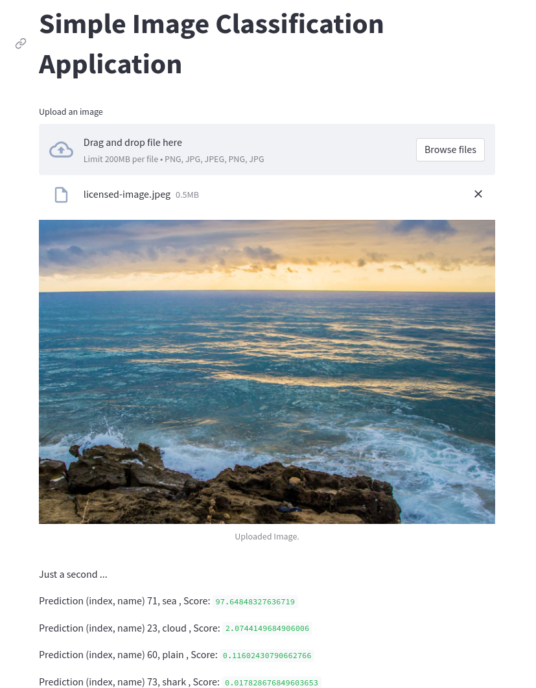

## Computer Vision - CIFAR-100-basic
### Introduction
- Apply MLops processing to development production
  + Using FastAPI for make API
  + Using Streamlit for frontend
  + Dockerlize
  + Monitor with WANDB
  + Deploy to GCP
### Set up: Docker compose
- Clone source code:
```
git clone https://github.com/TorRient/cifar100-basic.git
```

- To package the whole solution which uses multiple images/service, I am using Docker Compose. So there will be no need to build each of the previous images( Streamlit and FastAPI) separately. In the docker-compose.yml file this is configured and you could do that by running this command:
```
docker-compose up -d --build
```

- If you have made some changes in your yml file configuration, you first need to stop your containers by:
```
docker-compose down
```

- Then to run again your application, use this command:
```
docker-compose up -d
```

-Then you can see the app in the brouser using the Network URL: http://localhost:8501/

## Result

